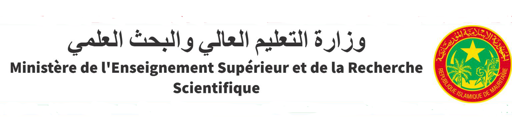
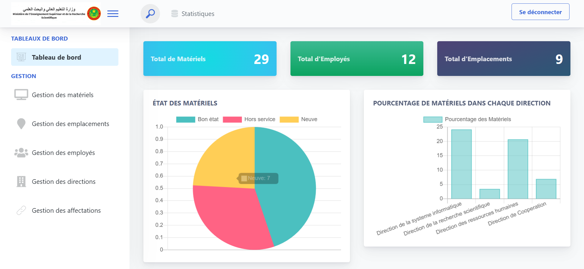

# **InventoryManagement - Inventory Management for the Ministry of Higher Education**

  
*(Replace with an image representative of your project.)*

---

## **Project Description**
**InventoryManagement** is a web application developed with Django to simplify and optimize inventory management within the Ministry of Higher Education. This project centralizes the tracking of material resources, manages stock, generates reports, and improves the traceability of equipment.

---

## **Key Features**
- **Material Management**: Add, modify, and delete material resources.
- **Stock Tracking**: View available quantities.
- **Reporting**: Generate detailed reports on stock status.
- **Authentication**: Secure access with a login system.
- **Intuitive Interface**: Interactive dashboard for simplified management.

---

## **Screenshots**
  

---

## **Prerequisites**
Before running this project, ensure you have the following installed on your machine:
- **Python 3.8 or higher**
- **Pip** (Python package manager)
- **Git** (to clone the repository)

---

## **Installation and Project Execution**

### **1. Clone the Repository**
Open a terminal and run the following command to clone the repository:
```bash
git clone https://github.com/your-username/InventoryManagement.git
cd InventoryManagement
python -m venv venv
**on Windows :**
venv/bin/activate
**on macOS/Linux :**
source venv/bin/activate

pip install -r requirements.txt

python manage.py migrate

python manage.py createsuperuser

python manage.py runserver
